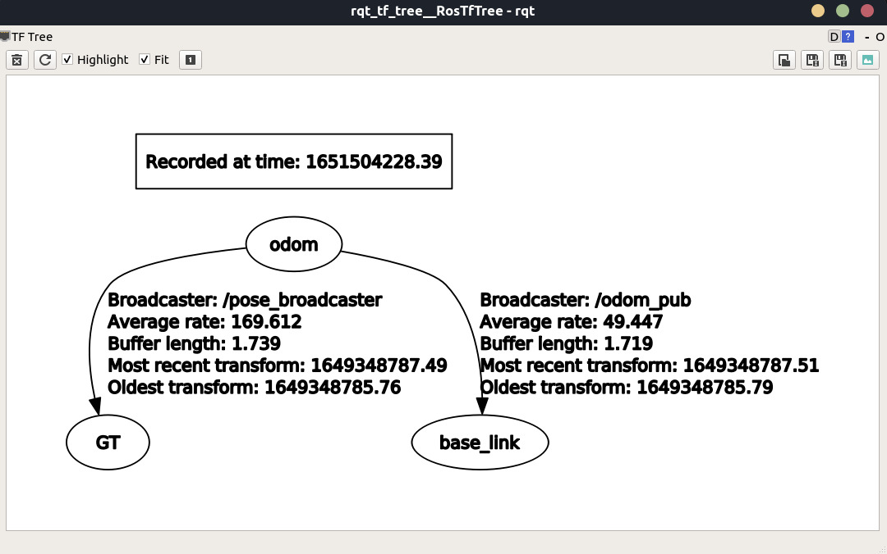
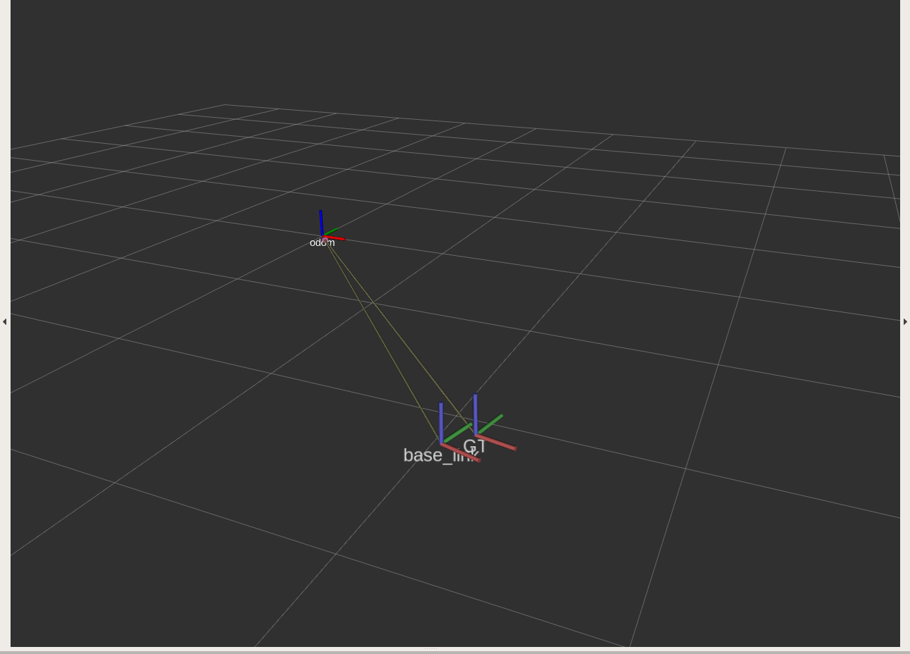
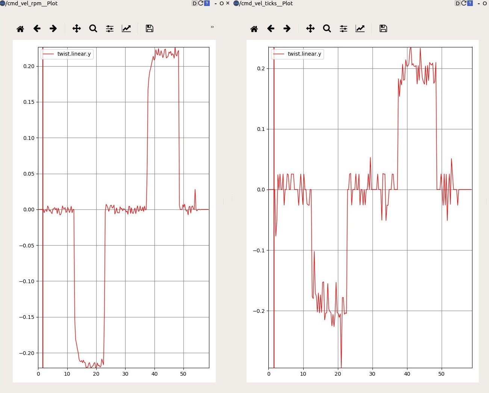
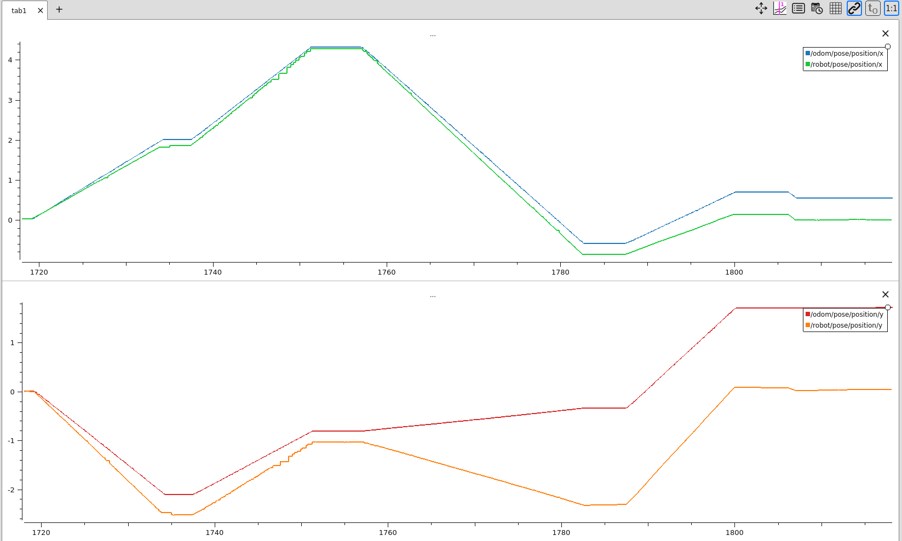
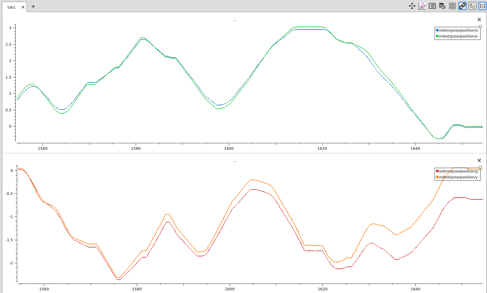
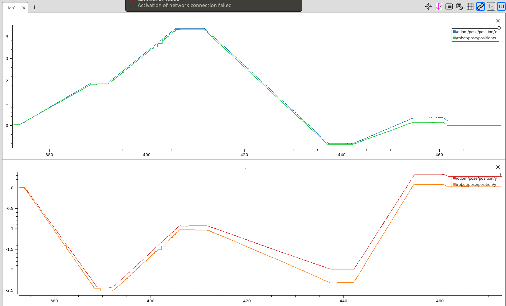
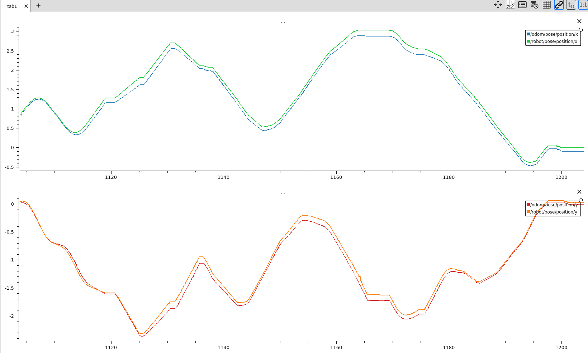
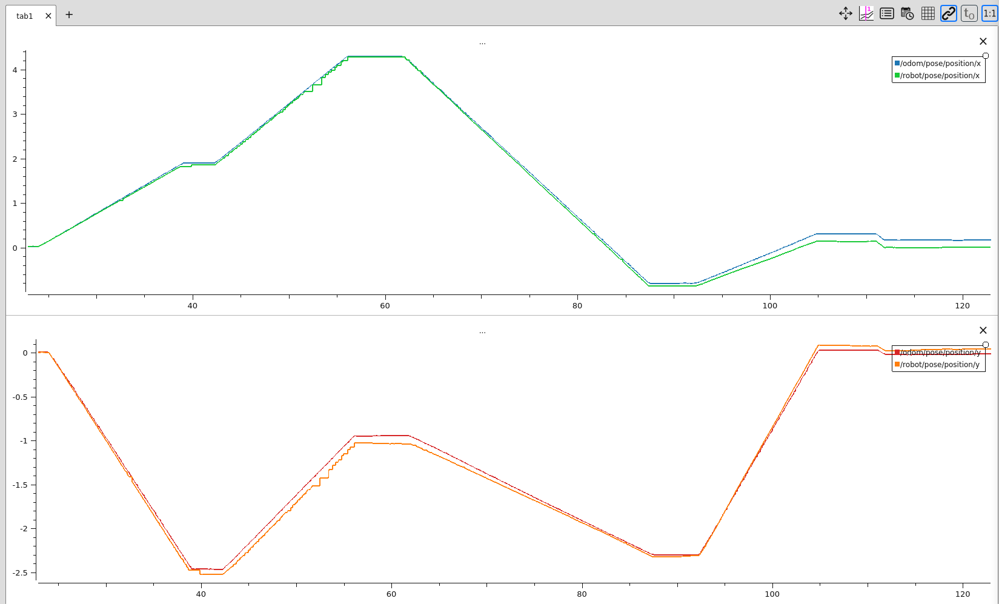
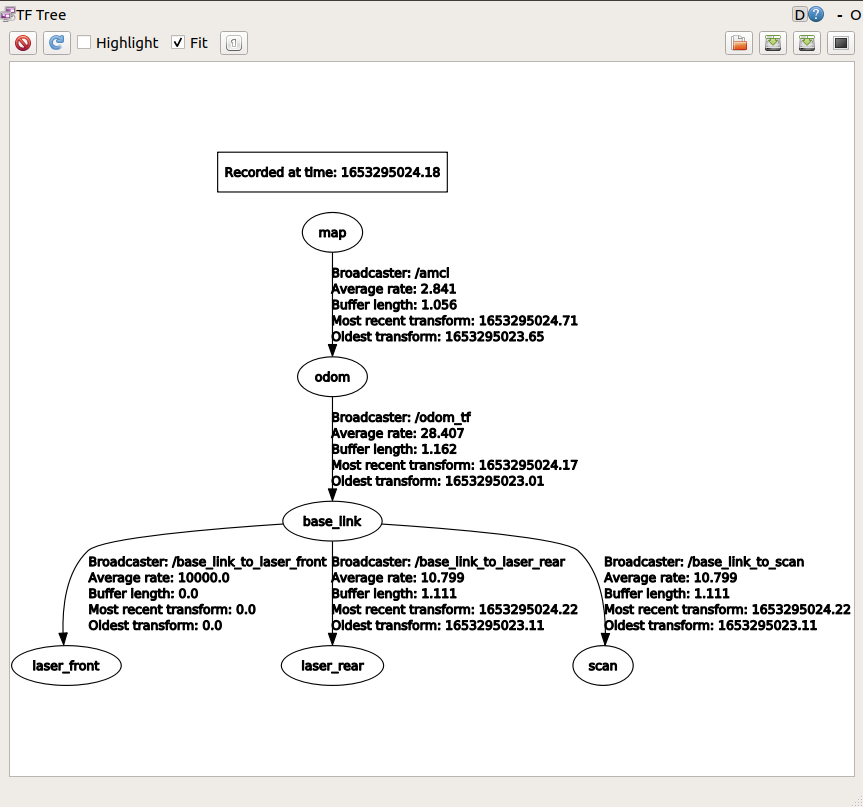

# Robotics - Project 1 2021/2022 

The first project requires to compute the odometry for an omnidirectional robot with four mecanum wheels.
<br />

## Group members:
- ###  [Gabriele Ginestroni](https://github.com/gabrieleginestroni)
- ###  [Tommaso Capacci](https://github.com/TommasoCapacci)

## Files
All of our code has been organized in a single package named _project1_. Inside this package we can find the following subdirectories:

| Directory | Description                                                            |
|-----------|------------------------------------------------------------------------|
| bags      | ros bags provided with the project specification                       |
| cfg       | file used for dynamic reconfigure of the integration type parameter    |
| csv       | support files used as input of python script for parameter calibration |
| launch    | launch file to start the implemented nodes                             |
| msg       | custom messages definition files                                       |
| python    | scripts used for parameter calibration                                 |
| src       | source files of ros nodes                                              |
| srv       | odometry reset service declaration file                                |

## Instructions
To start the project type the following code:

- ##### start roscore :
  ```shell
   > roscore
  ```

- ##### compile project in a new shell :
  ```shell
   > cd path/to/your/catkin_workspace
   > catkin_make
  ```

- ##### launch project nodes :
  ```shell
   > roslaunch project1 launcher.launch
  ```
  
## Project description
- ### Kinematics
Being: <br/> 
N = ticks count per revolution <br/> 
T = gear ratio <br/>
r = wheels radius <br/>
l = wheels position along x axis <br/>
w = wheels position along y axis <br/>

#### Wheels angular velocities:
  #### _from RPM)_ 
  &omega;<sub>rpm</sub> = <sup>1</sup>/<sub>(60 * T)</sub> * &omega;<sub>bags</sub>
  #### _from ticks)_ 
  &omega;<sub>ticks</sub> = <sup>2&pi;</sup>/<sub>(N * T)</sub> * <sup>&Delta;Ticks</sup>/<sub>&Delta;Time</sub>
#### Robot linear velocities:
  v<sub>x</sub> =  <sup>r</sup> / <sub>4</sub> * (&omega;<sub>fl</sub> + &omega;<sub>fr</sub> + &omega;<sub>rl</sub> + &omega;<sub>rr</sub>) <br/>
  v<sub>y</sub> = <sup>r</sup> / <sub>4</sub> * (&omega;<sub>fr</sub> - &omega;<sub>fl</sub> + &omega;<sub>rl</sub> - &omega;<sub>rr</sub>)
#### Robot angular velocity
  &omega; = <sup>r</sup> / <sub>4</sub> * <sup>1</sup> / <sub>(l + w)</sub> * (&omega;<sub>fr</sub> + &omega;<sub>rr</sub> - &omega;<sub>fl</sub> - &omega;<sub>rl</sub>)
#### Inverse formulas:
  &omega;<sub>fl</sub> = <sup>(60 * T)</sup> / <sub>r</sub> * (v<sub>x</sub> - v<sub>y</sub> - &omega; * (l + w)) <br/>
  &omega;<sub>fr</sub> = <sup>(60 * T)</sup> / <sub>r</sub> * (v<sub>x</sub> + v<sub>y</sub> + &omega; * (l + w)) <br/>
  &omega;<sub>rl</sub> = <sup>(60 * T)</sup> / <sub>r</sub> * (v<sub>x</sub> + v<sub>y</sub> - &omega; * (l + w)) <br/>
  &omega;<sub>rr</sub> = <sup>(60 * T)</sup> / <sub>r</sub> * (v<sub>x</sub> - v<sub>y</sub> + &omega; * (l + w))

- ### Parameters:
We created some custom parameters inside the parameter server in order to use them to change some important aspects of the project without needing to recompile it.
These are:

| Parameter                    | Description                                                                      |
|------------------------------|----------------------------------------------------------------------------------|
| /initial_pose_x              | used to set the initial position along the x axis                                |
| /initial_pose_y              | used to set the initial position along the y axis                                |
| /initial_pose_theta          | used to set the initial yaw angle of the robot                                   |
| /N                           | counts per revolution value                                                      |
| /R                           | wheels radius value                                                              |
| /LW                          | (l + w) value                                                                    |
| /odom_pub/integration_method | used to set integration method (see [Dynamic reconfigure](#dynamic-reconfigure)) |

- ### Requested nodes
| Node      | Description                                                       |
|-----------|-------------------------------------------------------------------|
| /vel_pub  | computes base_link velocities starting from bags data             |
| /odom_pub | computes robot odometry starting from base_link velocities        |
| /inverter | computes wheels angular speeds starting from base_link velocities |

- ### Support nodes
| Node              | Description                                                                                                                          |
|-------------------|--------------------------------------------------------------------------------------------------------------------------------------|
| /synchronizer     | synchronizes /robot/pose and /wheel_states messages and merges their most relevant data in a custom message for calibration purposes |
| /pose_broadcaster | intercepts /robot/pose messages and changes their frame-id to "odom" and child-frame-id to "GT", allowing for visualization on rviz  |

- ### Topics
| Topic            | Message type               | Publisher      | Subscribers                          | Description                                                                 |
|------------------|----------------------------|----------------|--------------------------------------|-----------------------------------------------------------------------------|
| /cmd_vel         | geometry_msgs/TwistStamped | /vel_pub       | /odom_pub, /inverter, /synchronizer* | base_link linear and angular velocities                                     |
| /odom            | nav_msgs/Odometry          | /odom_pub      |                                      | position computed by integrating base_link velocities                       |
| /robot/pose      | geometry_msgs/PoseStamped  |                | /pose_broadcaster                    | ground truth (GT) pose measured with Optitrack system                       |
| /w_rpm**         | project1/RpmStamped        | /vel_pub       |                                      | wheels angular speed computed from RPM [rad/s]                              |
| /w_ticks**       | project1/RpmStamped        | /vel_pub       |                                      | wheels angular speed computed from TICKS [rad/s]                            |
| /wheel_states*** | sensor_msgs/JointState     |                | /vel_pub, /synchronizer*             | angular speed [rad/min] and current encoder position for each wheel's motor |
| /wheels_rpm      | project1/RpmStamped        | /vel_pub       |                                      | wheels angular speed computed from robot's linear and angular velocities    |
| /pose_vel_sync   | project1/PoseVelSync       | /synchronizer* |                                      | motors' angular speeds [rad/min] and robot pose (GT) synchronized           |

*Note: the provided launch file does not start the _synchronizer_ node, which has been used only for producing the calibration bag files <br/>
**Note: /w_rpm and /w_ticks topics have been used to compare the noise that affects the wheel's RPM measurements and the ones from ticks (see [Parameters Calibration](#parameters-calibration)). <br/>
***Note: /wheel_states topic has been also used to compare the results computed by the _/inverter_ node with the real RPM of the motors  
 
- ### Custom messages
| Name        | Structure                                                                                                                                                                                                                                                                     | Description                                                                                                                 |
|-------------|-------------------------------------------------------------------------------------------------------------------------------------------------------------------------------------------------------------------------------------------------------------------------------|-----------------------------------------------------------------------------------------------------------------------------|
| PoseVelSync |  <br/> uint32 sec <br/> uint32 nsec <br/> float64 poseX <br/> float64 poseY <br/> float64 q_x <br/> float64 q_y<br/> float64 q_w <br/> float64 q_z <br/> float64 rpm_fl <br/> float64 rpm_fr <br/> float64 rpm_rl <br/> float64 rpm_rr <br/>  | used for calibration purposes, this message contains the ground truth pose and wheels' data, synchronized at each timestamp |
| RpmStamped  |  <br/> Header header <br/> float64 rpm_fl <br/> float64 rpm_fr <br/> float64 rpm_rr <br/> float64 rpm_rl <br/>                                                                                                                                | as requested from the project specification, this message contains wheels' RPM velocities computed by the */inverter* node  |

## Dynamic reconfigure
As requested, our project supports dynamic reconfigure on the integration method used by the _/odom_pub_ node. To fulfill this task we designed an enumeration with 2 values and used this to populate a parameter of the parameter server : depending on the stored value our node will use Euler's integration method (0, the default one) or the Runge-Kutta's one (1). <br/>
To try this feature we recommend using the _rqt_reconfigure_ tool, already shipped with ros. To do this type: 
 ```shell
   > rosrun rqt_reconfigure rqt_reconfigure
  ```
and a separate window will pop up.

## Odometry reset service
The project also provides a service to set the current pose (both position and orientation) at any point and yaw angle. Here's an 
example on how to use it:
```shell
   > rosservice call /reset_odom_to_pose new_x new_y new_theta
  ```
where new_x is the requested position along the x axis, new_y the one along the y axis and new_theta the orientation measured w.r.t the positive direction of the x axis in radians. 

## TF
The TF tree results:
<p align="center">
  
</p>

which allowed us to visualize our data on rviz as follows:
<p align="center">
  
</p>

## Parameters Calibration
Since the provided ticks data from bags have much more noise than RPM data, we decided to perform the calibration in two different ways, the first using the RPM measurements to avoid any possible overfitting
to the ticks' noise, the other directly with the ticks measurements.

<p align="center">
  
</p>
<p align="center">
 Profile of a linear velocity (Vx) computed from RPM (left) vs the one computed from ticks
</p>

|  |  |
|----------------------------------------------------|----------------------------------------------------|
| _Performance on bag 2 with given parameters_       | _Performance on bag 3 with given parameters_       |

The first calibration has been divided into 2 phases: 
1) We started by calibrating R and L+W parameters with RPM data, computing in _calibration.py_ the odometry by integrating with Runge-Kutta the velocities
stored in the calibration csv files and picking parameters from reasonable and fully parametric intervals.
Then, residual sum of squares (RSS) with euclidean distance between optitrack measured position (x,y) and the position obtained by odometry has been used to evaluate the parameters.
Two separated calibrations have been performed, one on bag 2 and the other one on bag 3, to account for odometry errors caused by complex movements of the robot.
Among the two set of possible best parameters we picked the one with smaller RSS by cross-validating with respect to the two bags.
2) Finally, we computed the optimal value of N using _N_calibration.py_: keeping the values of R and L+W fixed to the ones found at the previous step, we estimated N by computing the odometry using ticks' data.

|  |  |
|-------------------------------------------------------|-------------------------------------------------------|
| _Performance on bag 2 with estimated parameters (N=38, R=0.0677, LW=0.3587)_      | _Performance on bag 3 with estimated parameters (N=38, R=0.0677, LW=0.3587)_      |

The second calibration has been performed in a similar way: starting from the optimal value of N we already found we executed a grid search on different values of R and L+W which were tested using again the odometry calculated directly from ticks.

|  |  |
|-------------------------------------------------------|-------------------------------------------------------|
| _Performance on bag 2 with estimated parameters (N=38, R=0.0678045, LW=0.35301507)_      | _Performance on bag 3 with estimated parameters (N=38, R=0.0678045, LW=0.35301507)_      |

Separating the calibration of the N parameter from the calibration of the others turned out to be convenient even because R and N are strongly correlated in the speeds formulas, leading to a unique solution which would not be possible in case of all-in-one calibration.
Comparing the plots, we decided to pick the parameters computed from ticks data.

# Robotics - Project 2 2021/2022 

The second project requires to perform mapping and localization with an homemade omnidirectional robot with four mecanum wheels.
<br />

## Group members:
- ###  [Gabriele Ginestroni](https://github.com/gabrieleginestroni)
- ###  [Tommaso Capacci](https://github.com/TommasoCapacci)

## Files
All of our code has been organized in a single package named _project2_. Inside this package we can find the following subdirectories:

| Directory | Description                                      |
|-----------|--------------------------------------------------|
| bags      | ros bags provided with the project specification |
| config    | configuration files for gmapping and  amcl       |
| launch    | launch files to start mapping and localization   |
| scripts   | python ros nodes for trajectory and map editing  |
| src       | ros node for publishing the odometry tf          |
| srv       | trajectory drawer service declaration file       |
| map       | maps images and .yaml                            |

## Instructions
To start the project type the following code:

- ##### compile project in a new shell :
  ```shell
   > cd path/to/your/catkin_workspace
   > catkin_make
  ```

- ##### launch gmapping :
  ```shell
   > roslaunch project2 mapping.launch
  ```

- ##### launch amcl localization :
  ```shell
   > roslaunch project2 localization.launch
  ```
  
## Project description

- ### Nodes for gmapping
| Node      | Description                                                       |
|-----------|-------------------------------------------------------------------|
| /base_link_to_laser_front  | static TF broadcaster              |
| /base_link_to_laser_rear | static TF broadcaster        |
| /base_link_to_scan | static TF broadcaster |
| /laserscan_multi_merger |node from ira_laser_tools for merging scans from the two sensors  |
| /odom_tf | TF broadcaster for odometry  |
| /occupancy_grid_processing | outputs de-noised version of the map as a topic   |
| /slam_gmapping | gmapping node for mapping  |
Bag file robotics1_final.bag has been used for creating the map with gmapping.

To save the map, we've used the map_server ROS node that provides the map_saver command-line utility,
which allows to save the map to file.

- ### Nodes for localization
| Node      | Description                                                       |
|-----------|-------------------------------------------------------------------|
| /base_link_to_laser_front  |  static TF broadcaster            |
| /base_link_to_laser_rear |  static TF broadcaster       |
| /base_link_to_scan | static TF broadcaster  |
| /laserscan_multi_merger | node from ira_laser_tools for merging scans from the two sensors  |
| /odom_tf | TF broadcaster for odometry |
| /map_server | publishes map as a topic  |
| /path_finder | python node that prints the robot trajectory into the map image |
| /amcl | amcl node for localization   |
Bag files robotics2_final.bag and robotics3_final.bag have been used to test localization

## Trajectory drawer service
The project provides a service that can be called to save a pgm image of the map with the trajectory the robot has followed so far 
```shell
   > rosservice call /draw_path
  ```
the map will be saved in the map folder as _map_with_path.pgm_

## TF 

In case of gmapping the tf transform between map and odom is provided by the /slam_gmapping node

## Fine tuning
Starting from the default parameters we tuned the ones related to the sensors (YDLIDAR G4) to match the vendor datasheet.
Other relevant amcl parameters that we changed are odom_model_type (omni) and laser model type (beam).
